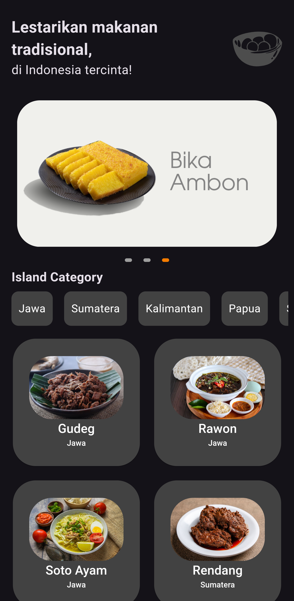
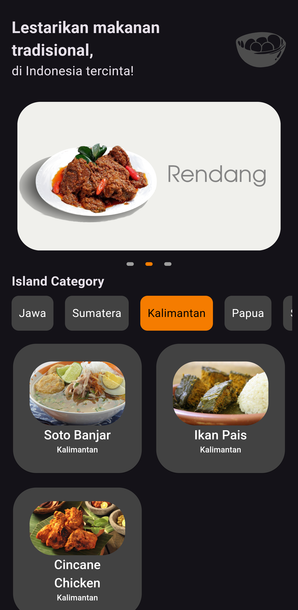
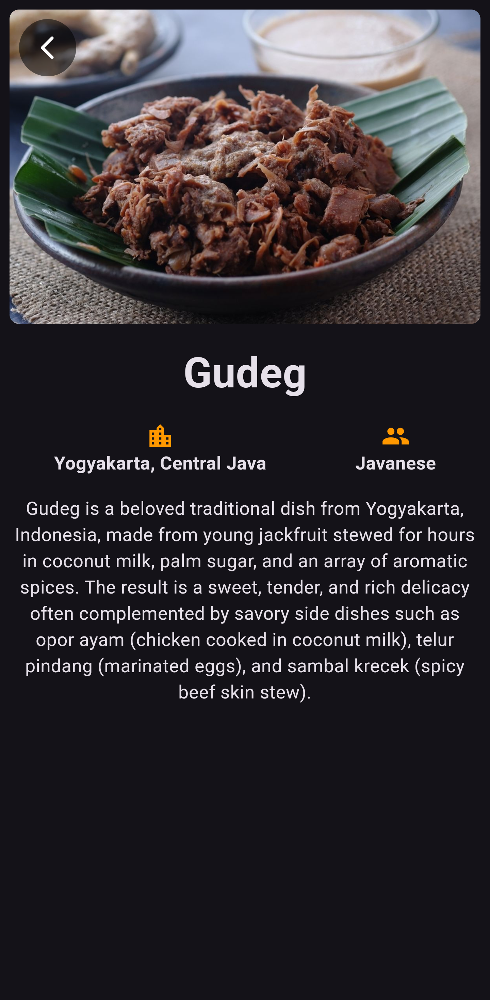
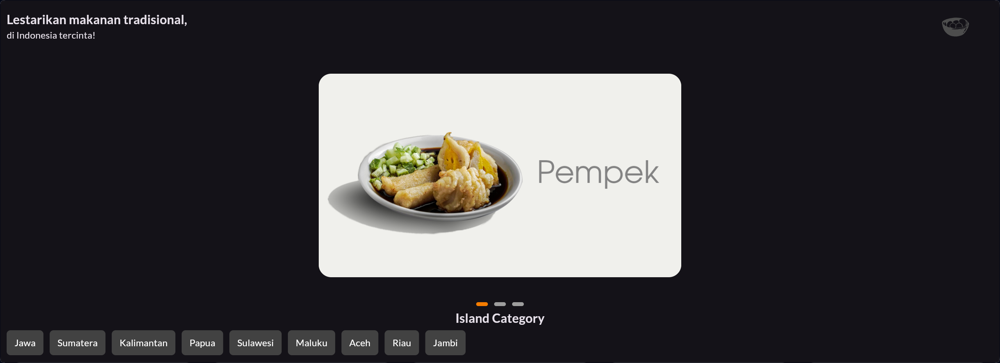
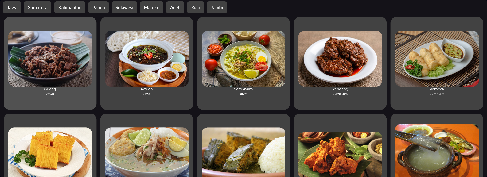

<h1 align="center">Nusantara-Bites!&nbsp;&nbsp;
    
</h1>


This is the source code for "**Nusantara-Bites!**", an application made to complete the final project of IDCamp 2024 of Multiplatform App Developer learning path of "Belajar Fundamental Aplikasi Flutter" class.

## What is this?

"Nusantara-Bites!" is a flutter based application that contain 27 Indonesian traditional food. "Nusantara-Bites!" contains images, description, place of origin, and what tribe that preserve the food.

## Table of Contents
- [What is this?](#what-is-this)
- [Table of Contents](#table-of-contents)
- [Screenshots](#screenshots)
  - [Android Screenshots](#android-screenshots)
  - [Web Screenshots](#web-screenshots)
- [Dependencies](#dependencies)
- [Setup](#setup)

## Screenshots
### Android Screenshots
<table>
    <tbody>
        <tr>
            <td></td>
            <td></td>
            <td></td>
        </tr>
    </tbody>
</table>

### Web Screenshots
<table>
    <tbody>
        <tr>
            <td></td>
        </tr>
        <tr>
            <td></td>
        </tr>
        <tr>
            <td></td>
        </tr>
    </tbody>
</table>

## Dependencies

- google_fonts
- carousel_slider
- get
- flutter_svg

## Setup

1. **Download or Clone Project**
   - To download, click on the "Code" button, then select "Download ZIP".
   - To clone, use the following Git command: git clone https://github.com/insanansharyrasul/nusantara_bites.git
2. **Run the Flutter App**
    - There is two options to run this app, on the web or on the app
        - Web
            1. Run 
          ```
          flutter build web
          ```
            2. On the `./build/web/` directory, run 
            ```
            python -m http.server 8000
            ```
            3. Open `localhost:3000` to see the app in web version
        - Android
            1. Run 
          ```
          flutter build apk
          ```
            2. On the `./build/outputs/apk/debug/` exist the `.apk` file so it can be installed to your smartphone
